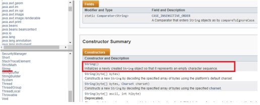

# La classe String

Com ja hem comentat, per a la gestió de les dades de tipus caràcter a Java no hi ha un tipus de dades primitiu, sinó que això es realitza a través de la classe **String**.

Per a la definició de variables ho farem com ho fèiem amb els tipus de dades primitives.

`String text=”Primer text”`

En aquest cas, text és una variable objecte o instància de la classe **String**.

String, com a classe que és, té els seus mètodes. Així, el mètode **lenght()** ens permet saber la longitud d’una cadena de caràcters, **charAt()** ens permet saber la posició d’un caràcter en una cadena, o **substring()** permet extreure una subcadena d’una cadena a partir d’una posició i un nombre de caràcters a extreure o **equals()** ens diu si dues cadenes són iguals o no.

::: info Nota:
Cal tenir en compte que la primera posició d'una cadena no és la 1 sinó la 0.
:::

Els mètodes d’aquesta classe no estan declarats com a **estàtics**. És per això que per a utilitzar-los necessitarem **instanciar una variable de tipus String** mitjançant un **constructor**.

Un constructor ens permetrà instanciar els objectes que utilitzarem d'aquesta classe i té el mateix nom que la classe. Ens podem trobar amb classes que tenen diversos constructors amb el mateix nom, però diferents paràmetres, és a dir, que són per a diferents usos. De moment, ens quedarem amb aquesta idea i ja l'aprofundirem més endavant. En el nostre cas farem servir el primer constructor.



>***Exemple de la classe String.***
>
>::: details Codi
>
>```java
>public class UF04ExempleClasseString {
>    public static void main(String[] args) {
>        
>        String descartes="Pense, aleshores existisc";
>        System.out.println("Descartes diu: " + descartes);
>        System.out.println("El que diu Descartes té una longitud de " + descartes.length() + " lletres");
>        System.out.println("El que diu Descartes comença per la lletra " + descartes.charAt(0));
>        int ultimaLletra=descartes.length();
>        System.out.println("L’última lletra es " + descartes.charAt(ultimaLletra-1));
>        System.out.println(descartes.substring(0, 16));
>    }
>}
>```
>
>:::