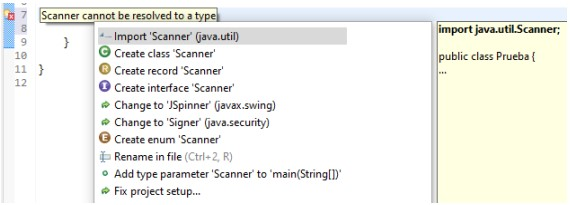
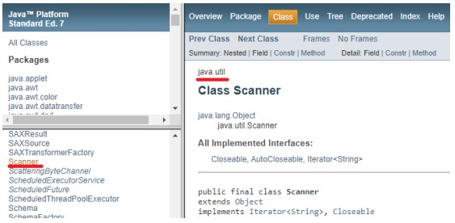
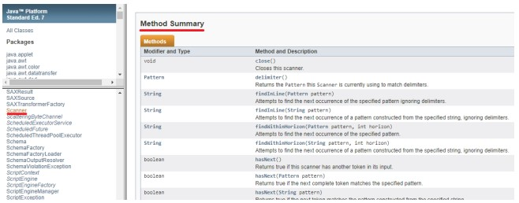

# La classe Scanner

Com havíem esmentat prèviament tots els mètodes de la classe Math i els mètodes de la classe String els hem pogut fer servir perquè pertanyen al paquet java.lang.

Però que passa si volem fer servir la classe Scanner. Aquesta classe no pertany al paquet per defecte java.lang, de manera que em donarà un error. Per tant, aquí sí que haurem de citar explícitament que volem fer servir un paquet.



Veiem que l'error m'està indicant que cal importar el paquet **java.util** per poder utilitzar aquesta classe. Per tant, la primera instrucció que introduirem a la nostra classe és:

`import java.util.*;`

La classe Scanner té una sèrie de mètodes que no són **estàtics** com **nextLine()** per introduir text, **nextInt()** per introduir nombres enters o **nextDouble()** per a nombres decimals. Això implica que per fer-los servir no és a través d'instància de la classe, sinó que implica la creació d'un objecte de la classe **Scanner** o, el que és el mateix, que la instanciem. Igualment, el mètode **hasNextInt()** i similars els podrem fer servir per verificar el tipus de dada introduïda per teclat.

Encara que això es veurà detalladament més endavant, per veure quin paquet hem d'importar podem consultar-lo per internet a la web Java API i buscarem la classe **Scanner**. Al principi veurem que ens indica quin paquet es troba, i per tant, aquest serà el que hem d'importar.



Igualment, si avancem a la pàgina més endavant ens indica quins són els constructors de la classe que ja em explicat que serveixen per a instanciar els objectes o variables que utilitzarem en aquesta classe.


Igualment, a la pàgina més endavant apareix la llista de mètodes d’aquesta classe.



Entre aquests mètodes trobarem els tres mètodes esmentats i com en veiem cap és **static**, la qual cosa implicarà que abans d'utilitzar-los haurem d'haver creat un objecte (o instanciat la classe).


Fent clic sobre aquests accedirem a la informació ampliada on comprovarem que no són estàtics.


Ara completarem el codi de la classe tal com s'indica a continuació.

Com veiem, primer instància la classe Scanner creant l’objecte “entrada” que utilitzarà a continuació per utilitzar els mètodes de la classe. Igualment, el resultat de la lectura s'emmagatzemarà en variables que cal definir amb el tipus de dades que corresponga.

>***Exemple:*** llegir text del teclat.
>::: details Codi
>
>```java
>public class UF04ExempleClasseScanner1 {
>    public static void main(String[] args) {
>
>        // Instanciem la classe Scanner per a realitzar les entrades
>        Scanner entrada = new Scanner(System.in);
>
>        // Sol·licitem la primera dada de tipus text a través de l'objecte Scanner creat
>        System.out.println("Introdueix el teu nom");
>        String nom=entrada.nextLine();
>
>        // Sol·licitem la segona dada de tipus text a través de l'objecte Scanner creat
>        System.out.println("Introdueix la teua edat");
>        int edat=entrada.nextInt();
>
>        // Mostrem els missatges d'eixida finals
>        System.out.println("Hola " + nom + ", tens " + edat + " anys.");
>        System.out.println("L'any que ve tindràs " + (edat+1) + " anys.");
>        entrada.close();
>    } 
>}
>```
>
>:::
>
>::: info Nota
>Què passa si en compte d'escriure (edat+1) escrivim el mateix sense els parèntesis? Realitza la prova.
>:::

Veiem un altre exemple.

>***Exemple:*** llegir un sencer del teclat i comprovar que és correcte.
>::: details Codi
>```java
>public class UF04ExempleClasseScanner2 {
> 
>    public static void main(String[] args) {
>        Scanner entrada = new Scanner(System.in);
>        int valor = 0;
>
>        System.out.print("Escriu un valor enter: ");
>        if (entrada.hasNextInt()) {
>            valor = entrada.nextInt();
>            System.out.println("El valor era " + valor + ".");
>        } else {
>            entrada.next();
>            System.out.print("El valor no era enter.");
>        }
>
>        entrada.nextLine();
>        entrada.close();
>    } 
>}
>```
>:::

El mètode de la classe Scanner vinculat a la lectura d’una cadena de text composta **d’una única paraula** és **next()**.

Recordeu que, si en una mateixa línia escrius més d'una paraula, successives invocacions a aquest mètode no bloquejaran el programa, sinó que aniran avaluant les successives dades pendents de llegir.

El mètode de la classe Scanner vinculat a la lectura d'una cadena de text en forma de frase on hi ha **diverses paraules separades per espais** és **nextLine()**.

